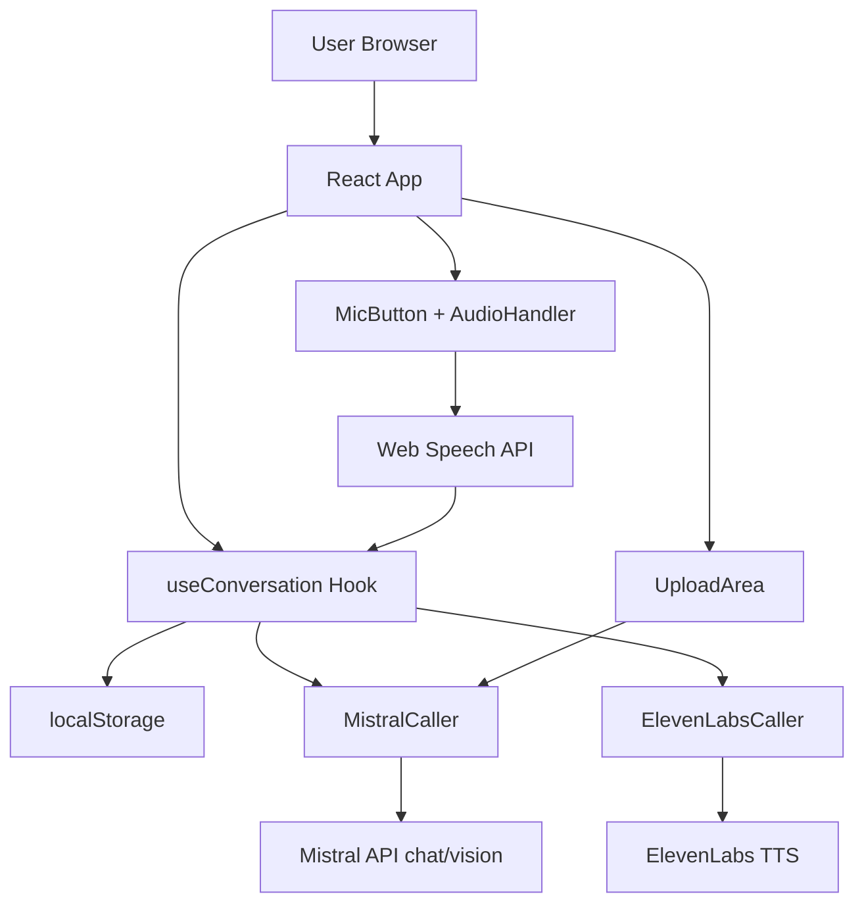

# Ink Echo - Design Document  
（requirementsおよびspecの条件をどのように実現するかの設計）

## 1. 全体アーキテクチャ
- Frontend: React + Vite + Tailwind CSS *(仕様: [SPEC-26](./spec.md#SPEC-26))*
- Backend: Vercel Serverless Functions（MVP）または Cloudflare Workers（冷起動優先時）
- 状態管理: localStorage（セッションIDをキーとするJSONオブジェクト） *(仕様: [SPEC-23](./spec.md#SPEC-23))*
- 外部サービス
  - STT: Web Speech API（Chrome優先） *(仕様: [SPEC-06](./spec.md#SPEC-06))*
  - LLM: Mistral API（chat: mistral-large-latest / vision: pixtral-12b） *(仕様: [SPEC-07](./spec.md#SPEC-07), [SPEC-15](./spec.md#SPEC-15))*
  - TTS: ElevenLabs Multilingual v2（日本語声） *(仕様: [SPEC-09](./spec.md#SPEC-09))*

## 2. 主要コンポーネントと責任

### 2.1 ConversationManager (useConversation hook)
- 責任: ターンカウント、履歴管理、再開判定 *(仕様: [SPEC-10](./spec.md#SPEC-10))*
- 実装: useState + localStorage同期
- キー項目
  - sessionId: UUID生成（初回マウント時）
  - turns: number（0〜7） *(仕様: [SPEC-10](./spec.md#SPEC-10))*
  - history: Message[]（{role: 'user'|'assistant', content: string}） *(仕様: [SPEC-22](./spec.md#SPEC-22))*
  - lastImageAnalysis: object（Vision解析結果） *(仕様: [SPEC-15](./spec.md#SPEC-15))*

### 2.2 AudioHandler
- 責任: 録音・STT・TTS再生 *(仕様: [SPEC-05](./spec.md#SPEC-05), [SPEC-09](./spec.md#SPEC-09))*
- 実装: Web Speech API + ElevenLabs fetch
- トーン切り替え: APIパラメータをターン数に応じて動的に変更 *(仕様: [SPEC-19](./spec.md#SPEC-19), [SPEC-20](./spec.md#SPEC-20))*

### 2.3 MistralCaller
- 責任: テキスト対話 + Vision解析 *(仕様: [SPEC-08](./spec.md#SPEC-08), [SPEC-15](./spec.md#SPEC-15))*
- 実装: 共通のfetchラッパー
- system prompt: specに記載のものを定数化 *(仕様: [SPEC-08](./spec.md#SPEC-08))*
- Visionプロンプト: 構造化JSON出力指定 *(仕様: [SPEC-15](./spec.md#SPEC-15))*

### 2.4 UIコンポーネント
- MicButton: 録音開始/停止 + ビジュアルフィードバック *(仕様: [SPEC-05](./spec.md#SPEC-05))*
- ConversationLog: 履歴表示（テキスト + 再生ボタン）
- UploadArea: ファイル入力 + プレビュー + アップロードボタン *(仕様: [SPEC-14](./spec.md#SPEC-14))*
- EndMessageOverlay: 7ターン終了時にオーバーレイ表示（「今、紙に書いてください」） *(仕様: [SPEC-12](./spec.md#SPEC-12))*

## 3. フロー詳細設計

### 3.1 通常ターン
1. ユーザーがMicButton押下 → 録音開始 *(仕様: [SPEC-05](./spec.md#SPEC-05))*
2. 録音終了 → Web Speech APIでテキスト化 *(仕様: [SPEC-06](./spec.md#SPEC-06))*
3. テキスト + 履歴 → Mistral API呼出 *(仕様: [SPEC-07](./spec.md#SPEC-07))*
4. 応答テキスト取得 → ElevenLabs TTS呼出（トーンはturnsに応じて調整） *(仕様: [SPEC-09](./spec.md#SPEC-09))*
5. 音声再生 → turns++ → localStorage保存 *(仕様: [SPEC-09](./spec.md#SPEC-09), [SPEC-23](./spec.md#SPEC-23))*

### 3.2 7ターン終了処理
1. turns === 7 検知 *(仕様: [SPEC-11](./spec.md#SPEC-11))*
2. 固定メッセージをElevenLabsで再生 *(仕様: [SPEC-12](./spec.md#SPEC-12))*
3. マイクボタン無効化（disabled） *(仕様: [SPEC-13](./spec.md#SPEC-13))*
4. UploadAreaを表示（オーバーレイ推奨）

### 3.3 写真アップロード → 再開
1. 画像選択 → FileReaderでbase64化 *(仕様: [SPEC-14](./spec.md#SPEC-14))*
2. base64 + 履歴 → Mistral Vision API *(仕様: [SPEC-15](./spec.md#SPEC-15))*
3. 解析結果取得 → 応答文生成（肯定的フィードバック + 再開案内） *(仕様: [SPEC-16](./spec.md#SPEC-16), [SPEC-17](./spec.md#SPEC-17))*
4. 応答文 → ElevenLabs TTS → 再生
5. 履歴に追加 → turnsを継続（またはリセットオプション） *(仕様: [SPEC-18](./spec.md#SPEC-18))*

## 4. 将来拡張対応設計

### 4.1 ストレージ抽象化
- interface Storage { getSession, saveSession, ... } *(仕様: [SPEC-31](./spec.md#SPEC-31))*
- 現在: LocalStorageImpl
- 将来: CloudflareKVImpl / SupabaseImpl を差し替え可能

### 4.2 同意フロー準備
- 将来用モーダルコンポーネントをコメントアウト状態で準備 *(仕様: [SPEC-30](./spec.md#SPEC-30))*
- 同意フラグをlocalStorageに保存（初期値false）

### 4.3 セッションIDの扱い
- 現在: ブラウザローカルUUID
- 将来: ユーザー認証後、サーバー側でuserId紐付け *(仕様: [SPEC-33](./spec.md#SPEC-33))*

### 4.4 Observabilityと自己改善（MCP & Weave統合）
- **ロギングとトレース**: Weights & Biases (W&B) Weaveの導入を想定したインターフェースを設ける。将来のMCPサーバー化を見据え、Mistral API等の呼び出しをWeaveクライアントで自動トレースするアーキテクチャとする。*(仕様: [SPEC-37](./spec.md#SPEC-37), [SPEC-40](./spec.md#SPEC-40))*
- **Evaluationsと最適化**: ユーザー満足度や機能継続率などを評価メトリクスとして定義し、Weave Evaluationsを用いてプロンプトエンジニアリングの最適化を行う仕組みを取り入れる。*(仕様: [SPEC-38](./spec.md#SPEC-38))*
- **プライバシー保護とデータライフサイクル**: トレースデータ送信前に個人情報・生録音データを匿名化・フィルタリング（要同意フラグ）。ハッカソン環境に合わせ、データは会期終了までの保持期間とし、明確な削除ポリシーを設ける。GDPR準拠など安全なデータ収集を行う。*(仕様: [SPEC-36](./spec.md#SPEC-36))*
- **メタフィードバックUI**: 成長曲線や評価結果等のW&Bダッシュボード可視化と連動し、ElevenLabsの音声で「君の声がInk Echoを賢くしてくれたよ」といったフィードバックをアプリ側で再生できるフックを設ける。*(仕様: [SPEC-39](./spec.md#SPEC-39))*

## 5. 実装時の注意点
- APIキー: .env.local に記述（Vercelデプロイ時に環境変数設定）
- エラーハンドリング: ネットワークエラー時は「もう一度話しかけて」と声で返す
- デモ用: 7ターン制限を一時的に3ターンに変更可能にするフラグを用意

## 6. ディレクトリ構成

```
ink-echo/
├── src/
│   ├── components/
│   │   ├── MicButton.tsx
│   │   ├── ConversationLog.tsx
│   │   ├── UploadArea.tsx
│   │   └── EndMessageOverlay.tsx
│   ├── hooks/
│   │   ├── useConversation.ts       # ターン・履歴・状態管理
│   │   └── useAudio.ts              # 録音・STT・TTS再生
│   ├── api/
│   │   ├── mistral.ts
│   │   └── elevenlabs.ts
│   ├── lib/
│   │   └── storage.ts               # 将来拡張用抽象化レイヤー
│   ├── App.tsx
│   └── main.tsx
├── public/
└── vite.config.ts
```

## コンポーネント図（簡易版）

